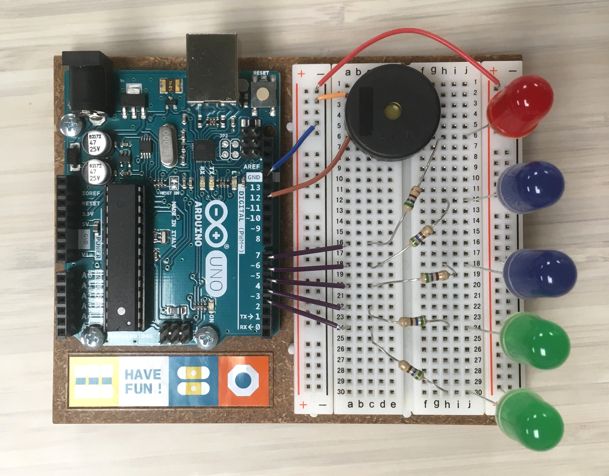

# lightningTimer

Arduino based timer for lightning talks

Press reset button to start timer. 
One LED represents each minute, the current minute blinks, then turns solid when complete. 
When time is up, all LEDs blink and buzzer beeps!

Built at the UIdaho MILL by Laila D. Engineer for UIdaho GIS Day Lightning Talks 2016
